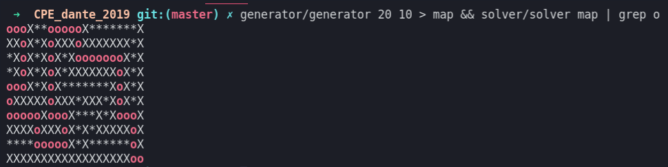
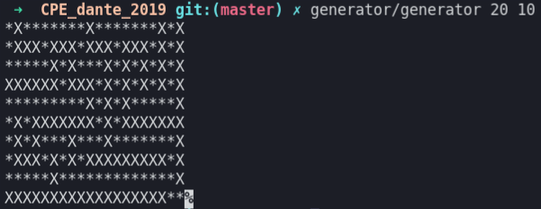
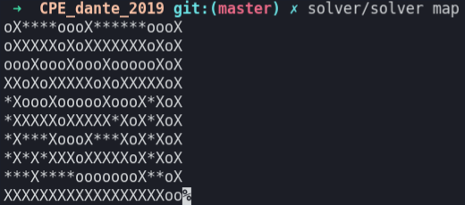
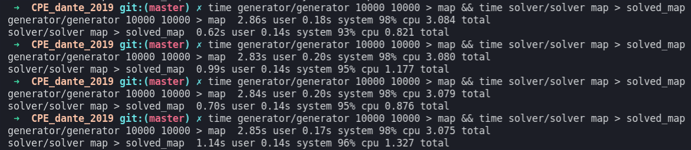
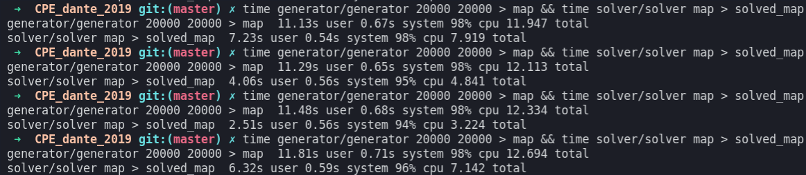
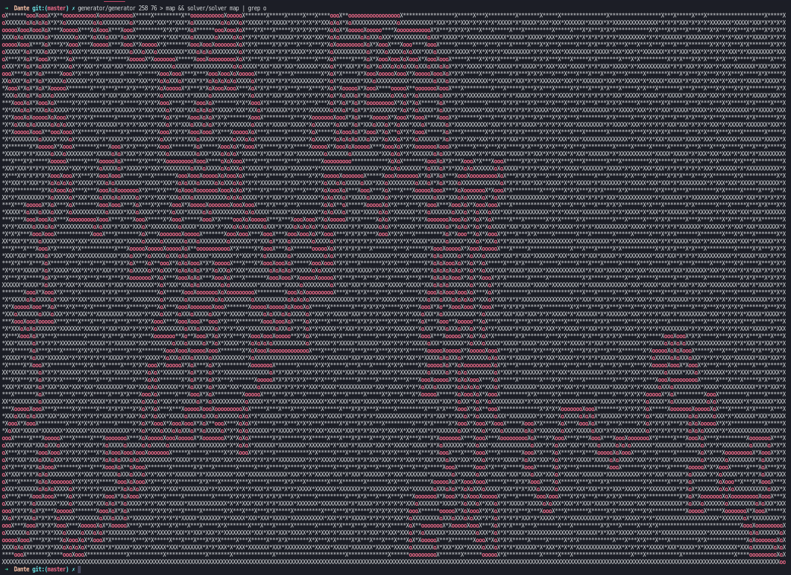

# Dante-s-star
Maze generator/solver

backtracking implementation in C

compilation via Makefile

This project work on linux

example :

generator/generator x y

solver/solver map_name

Start of a maze is the top-left corner and the end is the bottom-right corner

